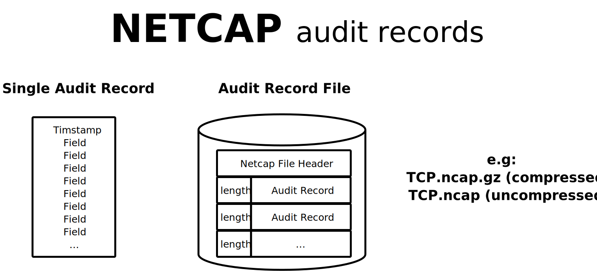

# Specification

_Netcap_ files have the file extension **.ncap** or **.ncap.gz** if compressed with gzip and contain serialized protocol buffers of one type. Naming of each file happens according to the naming in the [gopacket](https://godoc.org/github.com/google/gopacket) library: a short uppercase letter representation for common protocols, and a camel case version full word version for less common protocols. Audit records are modeled as protocol buffers. Each file contains a header that specifies which type of audit records is inside the file, what version of _Netcap_ was used to generate it, what input source was used and what time it was created. Each audit record should be tagged with the timestamp the packet was seen, in the format _seconds.microseconds_. Output is written to a file that represents each data structure from the protocol buffers definition, i.e. _TCP.ncap_, _UDP.ncap_. For this purpose, the audit records are written as length delimited records into the file.

## Delimited Protocol Buffer Records

The data format on disk consists of gzipped length-delimited byte records. Each delimited Protocol Buffer record is preceded by a variable-length encoded integer \(varint\) that specifies the length of the serialized protocol buffer record in bytes. A stream consists of a sequence of such records packed consecutively without additional padding. There are no checksums or compression involved in this processing step.

## Data Compression

Encoding the output as protocol buffers does not help much with reducing the size, compared to the CSV format. To further reduce the disk size required for storage, the data is gzipped prior to writing it into the file. This makes the resulting files around 70% smaller. Gzip is a common and well supported format, support for decoding it exists in almost every programming language. If this is not desired for e.g. direct access to the stored data, this can be toggled with the **-comp** command-line flag.

## Audit Records

A piece of information produced by Netcap is called an audit record. Audit records are type safe structured data, encoded as protocol buffers. An audit record can describe a specific protocol, or other abstractions built on top of observations from the analyzed traffic. Netcap does currently not enforce the presence of any special fields for each audit record, however by convention each audit record should have a timestamp with microsecond precision. A record file contains a header followed by a list of length-delimited serialized audit records. Naming of the audit record file happens according to the encoder name and should signal whether the file contents are compressed by adding the .gz extension.

