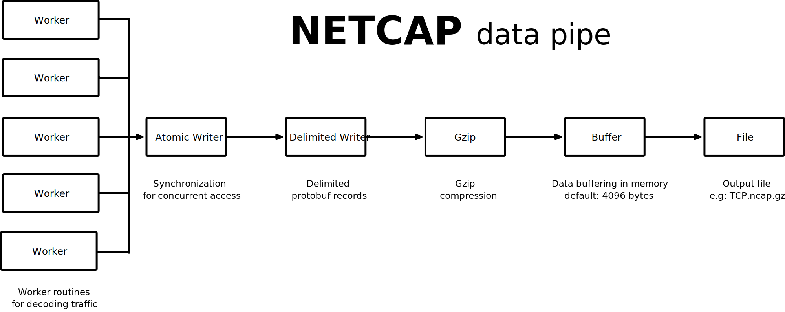

# Workers

To make use of multi-core processors, processing of packets should happen in an asynchronous way. Since Netcap should be usable on a stream of packets, fetching of packets has to happen sequentially, but decoding them can be parallelized. The packets read from the input data source \(PCAP file or network interface\) are assigned to a configurable number of workers routines via round-robin. Each of those worker routines operates independently, and has all selected encoders loaded. It decodes all desired layers of the packet, and writes the encoded data into a buffer that will be flushed to disk after reaching its capacity.

[Workers](https://github.com/dreadl0ck/netcap/blob/master/collector/worker.go) are a core concept of _Netcap_, as they handle the actual task of decoding each packet. _Netcap_ can be configured to run with the desired amount of workers, the default is 1000, since this configuration has shown the best results on the development machine. Increasing the number of workers also increases the number of runtime operations for goroutine scheduling, thus performance might decrease with a huge amount of workers. It is recommended to experiment with different configurations on the target system, and choose the one that performs best. Packet data fetched from the input source is distributed to a worker pool for decoding in round robin style. Each worker decodes all layers of a packet and calls all available custom encoders. After decoding of each layer, the generated protocol buffer instance is written into the _Netcap_ data pipe. Packets that produced an error in the decoding phase or carry an unknown protocol are being written in the corresponding logs and dumpfiles.

Each worker receives its data from an input channel. This channel can be buffered, by default the buffer size is 100, also because this configuration has shown the best results on the development machine. When the buffer size is set to zero, the operation of writing a packet into the channel blocks, until the goroutine behind it is ready for consumption. That means, the goroutine must finish the currently processed packet, until a new packet can be accepted. By configuring the buffer size for all routines to a specific number of packets, distributing packets among workers can continue even if a worker is not finished yet when new data arrives. New packets will be queued in the channel buffer, and writing in the channels will only block if the buffer is full.

### Data Pipe

The Netcap data pipe describes the way from a network packet that has been processed in a worker routine, to a serialized, delimited and compressed record into a file on disk.

